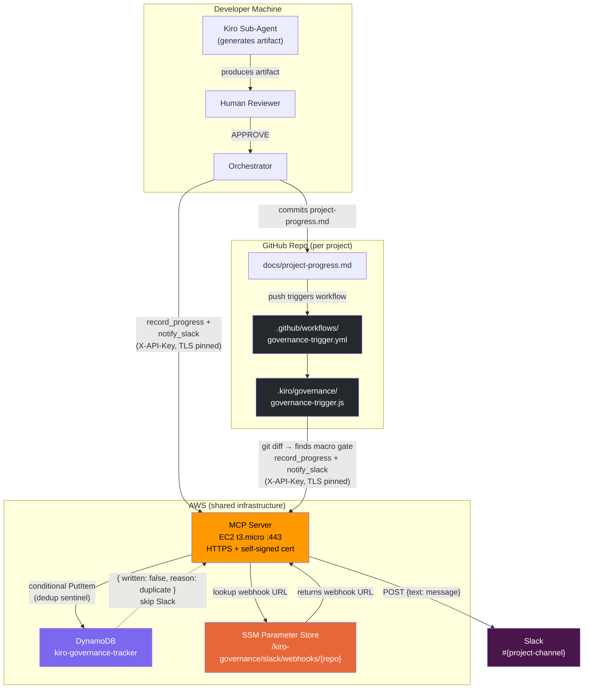

# Kiro Governance — End-to-End Flow



## Flow summary

| Path | Trigger | Steps |
|------|---------|-------|
| **Orchestrator** | Human types APPROVE in Kiro CLI | Agent → Human approval → Orchestrator calls MCP directly |
| **GitHub Actions** | Push to main with `project-progress.md` change | Workflow diffs file → detects macro gate → calls MCP |
| **Both paths** | Either of the above | MCP writes to DynamoDB (dedup) → looks up Slack webhook from SSM → posts message |

## Onboarding a new project

```bash
.kiro/governance/onboard.sh <path-to-project-repo> <slack-webhook-url>
```
